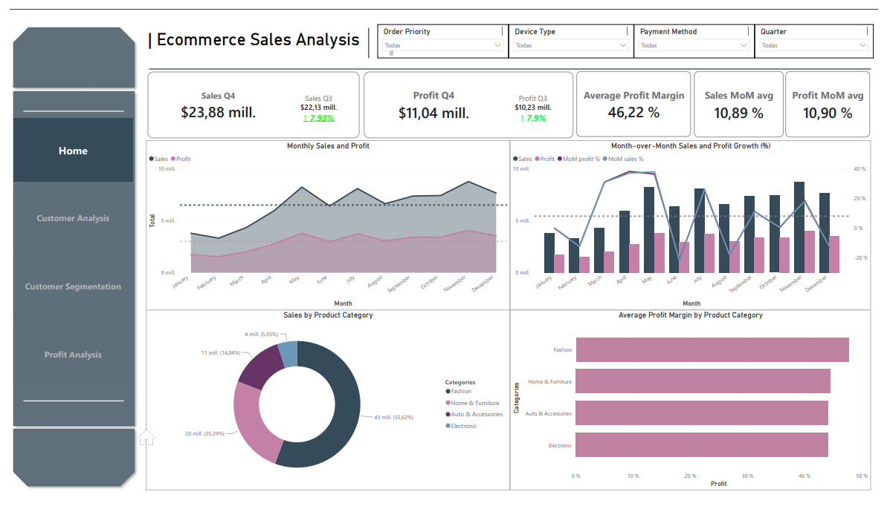
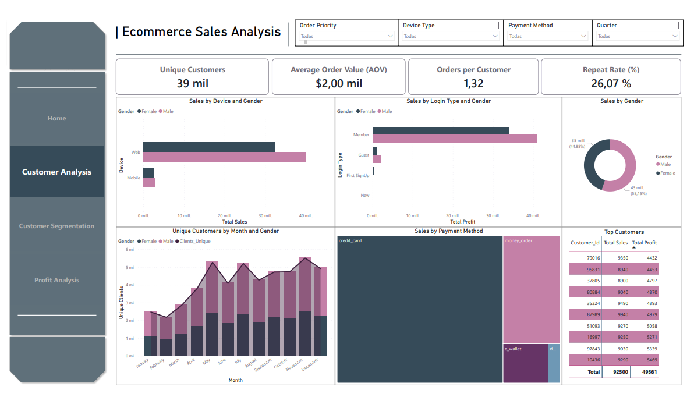
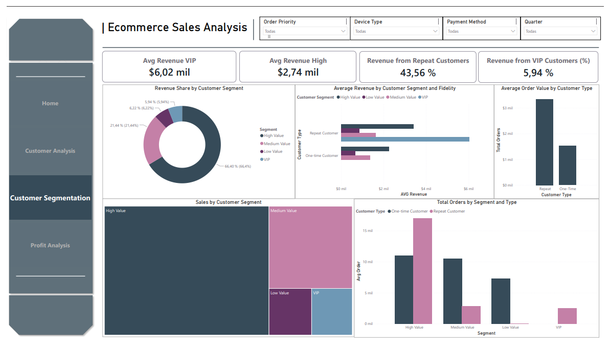
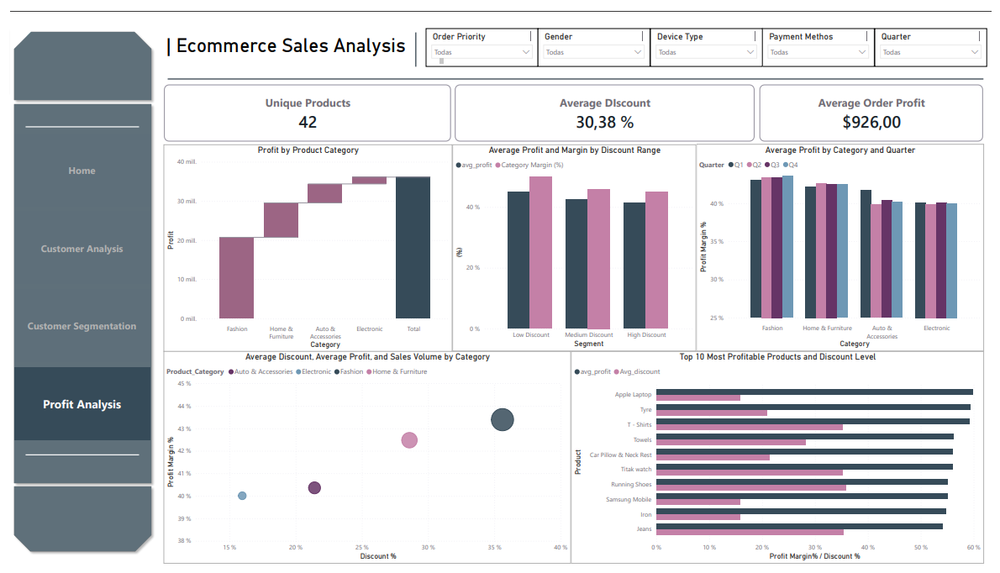

# 📊 Ecommerce Sales Analysis

Analytical dashboard developed in Power BI for a multi-channel e-commerce business. It enables monitoring of sales performance, profit margins and purchasing behaviour across 4 pages of interactive analysis with cross-filtering.

---

## 🛠️ Technology Stack

- **Power BI Desktop** — report development and visualisations
- **DAX** — calculated measures (MoM%, Profit Margin, dynamic KPIs)
- **Power Query (M)** — dataset transformation and cleaning
- **SQL (MySQL)** — data extraction, aggregation, and business metric calculations
- **Excel / CSV** — source data

---

## 📁 Project Structure

```
ecommerce-sales-analysis/
├── report/
│   └── ecommerce_sales.pbix
├── data/
│   └── dataset.csv
├── sql/
│   ├── home.sql
│   ├── customer_analysis.sql
│   ├── customer_segmentation.sql
│   └── profit_analysis.sql
├── images/
│   ├── home.png
│   ├── gender_disclosure.png
│   ├── profit_analysis.png
│   └── extra.png
└── README.md
```

## 🗃️ Database Schema

### Table: `ecomm_sales`

| Column | Type | Description |
|---|---|---|
| `Order_Date` | DATE | Date the order was placed |
| `Time` | TEXT | Time of the order |
| `Aging` | DOUBLE | Days since the order was placed |
| `Customer_Id` | INT | Unique customer identifier |
| `Gender` | TEXT | Customer gender |
| `Device_Type` | TEXT | Device used to place the order *(mobile, desktop…)* |
| `Customer_Login_type` | TEXT | Login method or account type |
| `Product_Category` | TEXT | High-level product category |
| `Product` | TEXT | Product name |
| `Sales` | DOUBLE | Total sale amount |
| `Quantity` | DOUBLE | Units ordered |
| `Discount` | DOUBLE | Discount applied |
| `Profit` | DOUBLE | Net profit on the order |
| `Shipping_Cost` | DOUBLE | Shipping cost |
| `Order_Priority` | TEXT | Priority level *(Low, Medium, High, Critical)* |
| `Payment_method` | TEXT | Payment method used |

> **Single table, no joins required.** All analysis is performed directly on `ecomm_sales`.


## 🎛️ Available Filters

All dashboards support cross-filtering via the following global slicers:

`Order Priority` · `Device Type` · `Payment Method` · `Quarter` · `Product Category` · `MonthName`

---


## 🏠 Dashboard 1/4 — Home Overview

The **Home** dashboard serves as the executive summary of the ecommerce operation,
providing a high-level view of sales and profitability trends. Q4 closed at **$23.88M in
sales and $11.04M in profit**, representing a solid **~7.9% quarter-over-quarter growth**
in both metrics. The business sustains a strong **average profit margin of 46.22%**, with
consistent month-over-month growth averaging around **10.89% in sales and 10.90% in
profit**




### 📌 Key KPIs — Home
| Metric | Value |
|---|---|
| Sales Q4 | $23.88M |
| Sales Q3 | $22.13M (+7.93%) |
| Profit Q4 | $11.04M |
| Profit Q3 | $10.23M (+7.9%) |
| Average Profit Margin | 46.22% |
| Sales MoM avg | 10.89% |
| Profit MoM avg | 10.90% |

---

### 📊 Results & Insights


- **Monthly Sales and Profit trend**: Both sales and profit show a **steady upward
trajectory throughout the year**, with sales consistently above the average threshold
(dotted line) from mid-year onward. The gap between sales and profit remains stable,
indicating controlled cost structures.
- **Month-over-Month Growth (%)**: MoM growth is **volatile but generally positive**,
with a notable spike around **April–May** and some negative dips in February and
December. This suggests sensitivity to seasonal campaigns or promotional cycles.
- **Sales by Product Category (donut)**: **Fashion dominates with 55.62%** of total
sales (~$43M), followed by Auto & Accessories (25.29%, ~$20M), Home & Furniture
(14.04%, ~$11M), and Electronic (5.05%, ~$4M).
- **Average Profit Margin by Category**: Despite Fashion leading in sales volume, **all
four categories show remarkably similar profit margins (~40–46%)**, with Fashion and
Home & Furniture slightly edging out the others. Electronics, though smallest in sales,
holds competitive margins.


### 🔗 Relevant SQL Queries

**Month-over-Month Sales & Profit** — uses a CTE to aggregate monthly totals, then applies `LAG()` window functions to compute absolute and percentage change in both sales and profit versus the prior month.

```sql
WITH monthly AS (
    SELECT
        DATE_FORMAT(Order_Date, '%Y-%m')  AS month,
        ROUND(SUM(Sales), 2)              AS total_sales,
        ROUND(SUM(Profit), 2)             AS total_profit
    FROM ecomm_sales
    GROUP BY month
)
SELECT
    month,
    total_sales,
    ROUND(total_sales - LAG(total_sales) OVER (ORDER BY month), 2)        AS sales_diff,
    ROUND((total_sales - LAG(total_sales) OVER (ORDER BY month))
        / LAG(total_sales) OVER (ORDER BY month) * 100, 2)                AS sales_mom_pct,
    total_profit,
    ROUND(total_profit - LAG(total_profit) OVER (ORDER BY month), 2)      AS profit_diff,
    ROUND((total_profit - LAG(total_profit) OVER (ORDER BY month))
        / LAG(total_profit) OVER (ORDER BY month) * 100, 2)               AS profit_mom_pct
FROM monthly
ORDER BY month;
```

**Quarter-over-Quarter Sales & Profit** — groups data by quarter, then computes margin, revenue share, and QoQ percentage change for both sales and profit using `LAG()` and `SUM() OVER ()`.

```sql
WITH quarterly AS (
    SELECT
        CONCAT('Q', QUARTER(Order_Date)) AS quarter,
        SUM(Sales)                        AS total_sales,
        SUM(Profit)                       AS total_profit
    FROM ecomm_sales
    GROUP BY quarter
)
SELECT
    quarter,
    ROUND(total_sales, 2)                                                      AS total_sales,
    ROUND(total_profit, 2)                                                      AS total_profit,
    ROUND(total_profit / total_sales * 100, 2)                                 AS profit_margin_pct,
    ROUND(total_sales / SUM(total_sales) OVER () * 100, 2)                     AS revenue_share_pct,
    ROUND((total_sales - LAG(total_sales) OVER (ORDER BY quarter))
        / LAG(total_sales) OVER (ORDER BY quarter) * 100, 2)                   AS sales_pct_change,
    ROUND((total_profit - LAG(total_profit) OVER (ORDER BY quarter))
        / LAG(total_profit) OVER (ORDER BY quarter) * 100, 2)                  AS profit_pct_change
FROM quarterly
ORDER BY quarter;
```

> 💡 Full query source available in [home.sql](./sql/home.sql)

### Conclusion

The Home dashboard paints a picture of a **healthy, growing ecommerce business** with
strong and consistent profit margins across all product categories. Fashion is the clear
revenue engine, but the uniformity of margins across categories suggests a
**well-balanced and efficiently managed product portfolio**. The MoM volatility warrants
attention — smoothing out the dips in February and December through targeted promotions
or inventory strategies could further solidify annual growth momentum.

## 👥 Dashboard 2/4 — Customer Analysis

This second dashboard of the **Ecommerce Sales Analysis** project provides an in-depth look at the profile and behaviour of the platform's customers. Complementing the general sales analysis from the first dashboard, the focus here shifts to who buys, how they buy and how frequently, enabling identification of key segments and loyalty patterns. The dashboard includes interactive filters by order priority, device type, payment method and quarter.




---

### 📌 Key KPIs

| Metric | Value |
|---|---|
| Unique Customers | 39,000 |
| Avg. Order Value | $2,000 |
| Orders per Customer | 1.32 |
| Repeat Rate | 26.07% |

---

### 📊 Results & Insights

- **Gender split** leans slightly toward **male customers (55.18%)** vs. female (44.85%),
as shown in the donut chart.
- **Device usage**: Web dominates sales for both genders, though **females drive
significantly higher web sales**, while mobile usage remains marginal across both groups.
- **Login type**: **Members generate the vast majority of sales and profit**, far outpacing
guests and new sign-ups, reinforcing the importance of membership programs for revenue.
- **Monthly trends**: Unique customers peak around **October–November**, likely driven by
seasonal campaigns, with a fairly consistent gender mix throughout the year.
- **Payment methods**: **Credit card and money order** are the dominant payment methods by
sales volume, with e-wallet representing a smaller but notable segment.
- **Top customers**: The highest-value customers reach up to **$9,940 in total sales and
$5,469 in profit**, with the overall top-10 segment generating **$92,500 in sales and
$49,561 in profit**.

### 🔗 Relevant SQL Queries

**New Customers per Month** — identifies each customer's first purchase date and groups by month to build the acquisition trend line.

```sql
SELECT
    DATE_FORMAT(first_purchase, '%Y-%m') AS month,
    COUNT(*)                             AS new_customers
FROM (
    SELECT
        customer_id,
        MIN(order_date) AS first_purchase
    FROM ecomm_sales
    GROUP BY customer_id
) t
GROUP BY month
ORDER BY month;
```

**Repeat Customer Rate** — calculates the percentage of customers with more than one order, feeding the retention KPI card.

```sql
SELECT
    ROUND(
        SUM(CASE WHEN total_orders > 1 THEN 1 ELSE 0 END) * 100.0
        / COUNT(*),
        2
    ) AS repeat_customer_rate_pct
FROM (
    SELECT
        customer_id,
        COUNT(*) AS total_orders
    FROM ecomm_sales
    GROUP BY customer_id
) t;
```

>💡 Full query source available in [customer_analysis.sql](./sql/customer_analysis.sql)

### Conclusion

The platform's revenue is heavily driven by **web-browsing, logged-in members paying by
credit card**, with **female customers slightly outspending** despite being the smaller
demographic group. Efforts to convert guests into members and increase mobile engagement
could meaningfully boost both sales volume and repeat rates.

---


## 📊 Dashboard 3/4 — Customer Segmentation

The **Customer Segmentation** dashboard breaks down revenue and order behavior across four
distinct customer tiers. VIP customers average **$6.02M in revenue**, while High Value
customers follow at **$2.74M AOV**. Notably, **43.56% of revenue comes from repeat
customers**, and VIP customers — despite being the smallest segment — account for
**5.94% of total revenue**.

---



### 📌 Key KPIs — Customer Segmentation
| Metric | Value |
|---|---|
| Avg. Revenue VIP | $6.02M |
| Avg. Revenue High Value | $2.74M |
| Revenue from Repeat Customers | 43.56% |
| Revenue from VIP Customers | 5.94% |

---


### 📊 Results and Insights


- **Revenue Share by Segment**: The largest share of the customer base belongs to
**High Value (66.40%)**, followed by Medium Value (21.44%), Low Value (6.22%), and VIP
(5.94%) — meaning the platform's base skews toward higher-spending customers, with a small
but impactful VIP elite.
- **Average Revenue by Segment & Fidelity**: **VIP repeat customers generate the highest
average revenue by far (~$6M+)**, with High Value repeat customers as a distant second.
One-time customers across all segments contribute significantly less, highlighting the
outsized impact of loyalty.
- **Average Order Value by Customer Type**: **Repeat customers spend more than twice as
much per order** compared to one-time customers, reinforcing that retention is a key
revenue lever.
- **Sales by Customer Segment (treemap)**: High Value and Medium Value segments dominate
the sales area, with Low Value and VIP occupying smaller but meaningful shares.
- **Total Orders by Segment and Type**: **High Value and Medium Value segments lead in
total order volume**, with repeat customers driving the bulk of orders in those tiers.
VIP customers place fewer but higher-value orders.


### 🔗 Relevant SQL Queries

**Customer Value Segmentation** — classifies each customer into a segment based on their total lifetime spend (VIP ≥ $5K, High Value ≥ $2K, Medium Value ≥ $1K, Low Value below that), then aggregates count, average revenue, average orders, and revenue share per segment.

```sql
WITH customer_sales AS (
    SELECT 
        customer_id,
        SUM(sales)      AS total_sales,
        COUNT(*)        AS total_orders,
        MAX(order_date) AS last_purchase
    FROM ecomm_sales
    GROUP BY customer_id
),
segmented AS (
    SELECT
        customer_id,
        total_sales,
        total_orders,
        last_purchase,
        CASE
            WHEN total_sales >= 5000 THEN 'VIP'
            WHEN total_sales >= 2000 THEN 'High Value'
            WHEN total_sales >= 1000 THEN 'Medium Value'
            ELSE                          'Low Value'
        END AS segment_name
    FROM customer_sales
)
SELECT
    segment_name,
    COUNT(*)                        AS customers,
    ROUND(AVG(total_sales), 2)      AS avg_revenue,
    ROUND(AVG(total_orders), 1)     AS avg_orders,
    ROUND(SUM(total_sales), 2)      AS segment_revenue,
    ROUND(
        SUM(total_sales) / SUM(SUM(total_sales)) OVER () * 100,
    2)                              AS revenue_share_pct
FROM segmented
GROUP BY segment_name
ORDER BY segment_revenue DESC;
```


**Customer Retention Analysis** — splits customers into One-time vs. Repeat based on order count, returning their distribution and average revenue to power the fidelity breakdowns across all charts.

 ```sql
SELECT
    CASE 
        WHEN total_orders = 1 THEN 'One-time'
        ELSE 'Repeat'
    END                         AS customer_type,
    COUNT(*)                    AS customers,
    ROUND(AVG(total_sales), 2)  AS avg_revenue,
    ROUND(
        COUNT(*) * 100.0 / SUM(COUNT(*)) OVER (), 
    2)                          AS pct_of_customers
FROM (
    SELECT
        customer_id,
        COUNT(*)   AS total_orders,
        SUM(sales) AS total_sales
    FROM ecomm_sales
    GROUP BY customer_id
) t
GROUP BY customer_type;
 ```

>💡 Full query source available in [customer_segmentation.sql](./sql/customer_segmentation.sql)


### Conclusion

The segmentation data reveals a clear strategic priority: **retaining and nurturing repeat
customers — especially in the VIP and High Value tiers — is the single most impactful lever
for revenue growth**. While Low Value customers represent a smaller portion of the base,
converting one-time buyers into repeat customers and identifying potential VIP candidates
within the Medium and High Value segments should be the core focus of any loyalty or
CRM strategy.


## 📊 Dashboard 4/4 — Profit Analysis

The **Profit Analysis** dashboard examines profitability across product categories,
discount strategies, and individual products. With **42 unique products**, an
**average discount of 30.38%**, and an **average order profit of $926**, the platform
maintains healthy margins despite aggressive discounting.




### 📌 Key KPIs — Profit Analysis
| Metric | Value |
|---|---|
| Unique Products | 42 |
| Average Discount | 30.38% |
| Average Order Profit | $926.00 |
---

### 📊 Results and Insights


- **Profit by Product Category**: The **Electronic** category leads in total profit
(~$35M+), followed by Auto & Accessories and Home & Furniture, with **Fashion being the
lowest-performing category** in absolute profit terms (~$20M).
- **Average Profit and Margin by Discount Range**: Interestingly, **Low Discount segments
yield the highest profit margins (~43%)**, while margins gradually decline as discounts
increase — confirming that heavy discounting erodes profitability.
- **Average Profit by Category and Quarter**: Profit margins remain **remarkably stable
across all four quarters** for every category, hovering between 38–43%, with no dramatic
seasonal swings. Fashion shows slightly more variability.
- **Discount vs. Profit Margin (bubble chart)**: **Electronic products carry the highest
discounts (~40%) but also maintain the highest profit margins (~43%)**, while Home &
Furniture and Fashion cluster at lower discount levels with moderate margins.
- **Top 10 Most Profitable Products**: **Apple Laptop leads by a wide margin** in both
average profit and discount level, followed by Tyre and T-Shirts. Products like Jeans and
Iron show lower profit margins with comparatively high discounts.


### 🔗 Relevant SQL Queries

**Product Category Analysis** — breaks down sales, profit, margin, and average discount by category, ordered by total profit to surface the most valuable segments.

```sql
SELECT 
    product_category,
    SUM(sales)                                AS total_sales,
    SUM(profit)                               AS total_profit,
    ROUND(SUM(profit) / SUM(sales) * 100, 2) AS margin_pct,
    AVG(discount)                             AS avg_discount
FROM ecomm_sales
GROUP BY product_category
ORDER BY total_profit DESC;
```

**Impact of Discount Level** — buckets orders into four discount tiers (None, Low, Medium, High) and measures the effect on order count, total profit, average profit, and margin per tier.

```sql
SELECT 
    CASE 
        WHEN discount = 0     THEN 'No Discount'
        WHEN discount <= 0.1  THEN 'Low Discount'
        WHEN discount <= 0.3  THEN 'Medium Discount'
        ELSE                       'High Discount'
    END                                       AS discount_segment,
    COUNT(*)                                  AS orders,
    SUM(profit)                               AS total_profit,
    ROUND(AVG(profit), 2)                     AS avg_profit,
    ROUND(SUM(profit) / SUM(sales) * 100, 2) AS margin_pct
FROM ecomm_sales
GROUP BY discount_segment
ORDER BY total_profit DESC;
```

**Top 10 Most Profitable Products** — returns the ten highest-profit products alongside their average discount, making it easy to spot whether top earners rely on discounting or not.

```sql
SELECT 
    product,
    SUM(profit)           AS total_profit,
    ROUND(AVG(discount), 2) AS avg_discount
FROM ecomm_sales
GROUP BY product
ORDER BY total_profit DESC
LIMIT 10;
```

>💡 Full query source available in [profit_analysis.sql](./sql/profit_analysis.sql)

### Conclusion

The Profit Analysis reveals that **Electronics is the star category** — driving the highest
absolute profit while sustaining strong margins even under heavy discounting. The data also
signals a clear trade-off: **lower discounts consistently produce better margins**, making
it critical to reassess discount strategies — particularly for Fashion and lower-performing
products. Stabilizing quarterly performance suggests the business is not overly dependent
on seasonal promotions, which is a healthy sign for long-term profitability.
