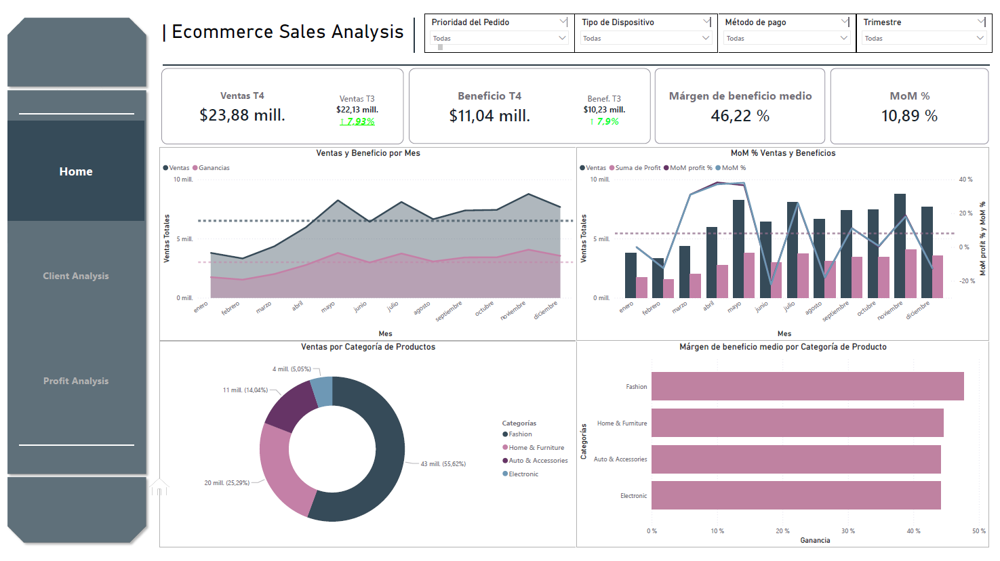
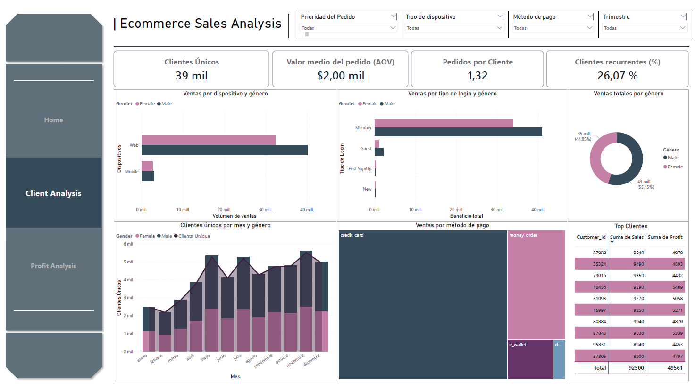
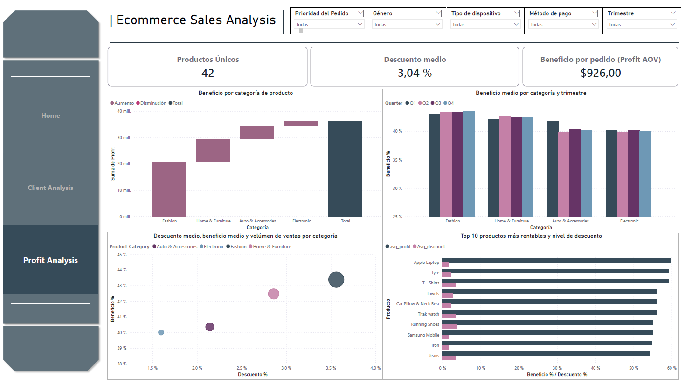

# 📊 Ecommerce Sales Analysis

Dashboard analítico desarrollado en Power BI para un e-commerce multicanal. Permite monitorizar el rendimiento de ventas, márgenes de beneficio y comportamiento de compra a través de 4 páginas de análisis interactivo con filtros cruzados.

---

## 🛠️ Stack tecnológico

- **Power BI Desktop** — desarrollo del informe y visualizaciones
- **DAX** — medidas calculadas (MoM%, Profit Margin, KPIs dinámicos)
- **Power Query (M)** — transformación y limpieza del dataset
- **Excel / CSV** — fuente de datos origen

---

## 📁 Estructura del proyecto

```
ecommerce-sales-analysis/
├── report/
│   └── ecommerce_sales.pbix
├── data/
│   └── dataset.csv
├── images/
│   ├── home.png
│   ├── gender_disclosure.png
│   ├── profit_analysis.png
│   └── extra.png
└── README.md

```

## 📄 Páginas del informe

###  🏠 Dashboard 1/3 — Home Overview

Este dashboard corresponde a la página principal (1/3) del análisis de ecommerce y ofrece una visión general del rendimiento del negocio. Aquí se resumen los principales indicadores del trimestre actual, incluyendo ventas totales, beneficios, margen de beneficio medio y crecimiento mes a mes (MoM), permitiendo evaluar rápidamente la salud financiera. Además, se presentan tendencias mensuales de ventas y ganancias para identificar patrones y estacionalidad, junto con un desglose por categorías de producto que muestra tanto la contribución a las ventas como la rentabilidad de cada segmento. Los filtros superiores permiten segmentar el análisis por prioridad de orden, tipo de dispositivo, método de pago y trimestre, facilitando una exploración dinámica de los datos.


 


**💡 Insights principales**

- **Fashion domina las ventas** con un 55,62% del total ($43M), siendo con diferencia la categoría más relevante tanto en volumen como en profit generado.
- **El margen global del 46,22%** es sólido, aunque Electronics muestra el profit más bajo de las cuatro categorías, lo que sugiere mayor coste o menor precio medio de venta.
- **La tendencia mensual de ventas** presenta picos en mayo y diciembre, indicando estacionalidad marcada que puede aprovecharse para campañas promocionales.
- **Home & Furniture** representa el segundo bloque de ventas (25,29%), con un profit relevante, lo que la convierte en una categoría estratégica de crecimiento.
- **El crecimiento MoM (promedio 10,89%)** muestra una tendencia general positiva, cerrando en torno al 10,89%, lo que confirma crecimiento sostenido; sin embargo, no es lineal. Hay picos fuertes (abril–mayo) seguidos de caídas marcadas (junio y agosto), lo que indica volatilidad mes a mes. Esto sugiere que el crecimiento está impulsado por eventos puntuales (promociones, campañas o estacionalidad) más que por una demanda completamente estable. 


**Comentarios Relevantes**

En general, se observa un crecimiento sólido y consistente tanto en ventas como en beneficios, con un incremento MoM positivo y márgenes saludables (~46%), lo que indica una operación rentable y bien controlada. Sin embargo, no todas las categorías aportan igual: Fashion lidera claramente en volumen de ventas, mientras que otras categorías mantienen márgenes similares pero menor peso, lo que abre una oportunidad para optimizar mix de producto o empujar categorías subexplotadas. A nivel temporal, hay cierta estacionalidad con picos hacia mitad y final de año, lo que sugiere que campañas o demanda estacional están influyendo significativamente. En conjunto, el negocio crece, pero el siguiente paso lógico no es solo vender más, sino diversificar ingresos y mejorar el rendimiento de categorías con menor contribución sin sacrificar margen.

El MoM muestra una tendencia general positiva, cerrando en torno al 10,89%, lo que confirma crecimiento sostenido; sin embargo, no es lineal. Hay picos fuertes (abril–mayo) seguidos de caídas marcadas (junio y agosto), lo que indica volatilidad mes a mes. Esto sugiere que el crecimiento está impulsado por eventos puntuales (promociones, campañas o estacionalidad) más que por una demanda completamente estable. 


### 👥  Dashboard 2/3 — Análisis de clientes

Este segundo dashboard del proyecto **Ecommerce Sales Analysis** profundiza en el 
perfil y comportamiento de los clientes de la plataforma. Complementando el análisis 
general de ventas del primer dashboard, aquí el foco se desplaza hacia quién compra, 
cómo compra y con qué frecuencia, permitiendo identificar segmentos clave y patrones 
de fidelización. El dashboard incluye filtros interactivos por prioridad de orden, 
tipo de dispositivo, método de pago y trimestre.


 

---

### 📌 KPIs Principales

| Métrica | Valor |
|---|---|
| Clientes Únicos | 39.000 |
| Avg. Order Value | $2.000 |
| Pedidos por Cliente | 1,32 |
| Repeat Rate | 26,07% |

---

### 📊 Resultados e Insights

**Distribución por género**

Las mujeres representan el **55,15%** de las ventas totales (43 millones) frente al 
**44,85%** de los hombres (35 millones). Esta diferencia es consistente a lo largo de 
todas las visualizaciones del dashboard, siendo el segmento femenino el dominante 
tanto en volumen de ventas como en número de clientes únicos mes a mes.

**Canal de acceso: Web vs. Mobile**

El canal **Web** concentra la gran mayoría del volumen de ventas en ambos géneros, 
superando ampliamente a Mobile. Esto indica que, pese al auge del comercio móvil, 
los clientes de esta plataforma siguen prefiriendo o completando sus compras 
principalmente desde escritorio, lo que puede ser una señal tanto de perfil 
demográfico como de oportunidad de mejora en la experiencia mobile.

**Tipo de login y valor generado**

Los usuarios de tipo **Member** son con diferencia los que mayor beneficio generan, 
muy por encima de Guest, First SignUp y New. Esto pone de manifiesto que la 
membresía actúa como un acelerador de valor: los clientes registrados y fidelizados 
no solo compran más, sino que lo hacen con tickets más altos. Incentivar la conversión 
de Guest a Member se presenta como una palanca estratégica clara.

**Fidelización y frecuencia**

Con una tasa de repetición del **26,07%** y una media de **1,32 pedidos por cliente**, 
existe un margen amplio de mejora en retención. Uno de cada cuatro clientes repite 
compra, lo cual es un punto de partida razonable, pero sugiere que las estrategias 
de reactivación y fidelización (email marketing, programas de puntos, ofertas 
personalizadas) podrían tener un impacto significativo.

**Evolución mensual de clientes únicos**

La base de clientes se mantiene estable entre enero y abril, con una aceleración 
notable a partir de **mayo**. Los picos más altos se registran en **noviembre y 
diciembre**, alineados con campañas estacionales como Black Friday y la temporada 
navideña. Esta estacionalidad marcada sugiere la importancia de planificar con 
antelación la capacidad y las acciones de captación en el último trimestre del año.

**Método de pago**

La **tarjeta de crédito** domina claramente el volumen de transacciones, seguida del 
**money order** y, en menor medida, el **e-wallet** y otros métodos. El patrón es 
similar entre géneros, sin diferencias relevantes en las preferencias de pago.

**Top Clientes**

Los clientes de mayor valor individual acumulan ventas de entre **8.940 y 9.940**, 
con beneficios que oscilan entre **4.432 y 5.469** por cliente. El total acumulado 
del top 10 asciende a **92.500 en ventas y 49.561 en beneficio**, lo que refleja 
una rentabilidad sólida en el segmento premium y abre la puerta a estrategias 
de atención personalizada o programas VIP.


## 📊 Dashboard 3/3 — Profit Analysis

El tercer y último panel del análisis se centra en la **rentabilidad del negocio**. 

 

El catálogo activo comprende **42 productos únicos**, con un descuento medio aplicado 
del **3,04 %** y un beneficio medio por pedido (**Profit AOV**) de **$926**,
lo que refleja un ticket elevado y márgenes saludables.

El gráfico en cascada (waterfall) muestra cómo se construye el beneficio total (~$38 M)
por categoría: **Fashion** aporta la base más sólida (~$20 M), seguida de
**Home & Furniture** y **Auto & Accessories**, mientras que **Electronics**, pese a ser
la categoría con mayor volumen de ventas, añade el incremento final. El análisis 
trimestral por categoría revela una **notable estabilidad** a lo largo del año,
con márgenes que oscilan entre el 40 % y el 45 % en todos los segmentos y trimestres,
sin picos ni caídas significativas — señal de una política de precios y descuentos
bien calibrada.

El scatter plot de descuento vs. beneficio pone de manifiesto una ligera tensión:
**Electronics y Fashion** operan con descuentos más altos (3–4 %) pero logran
mantener márgenes superiores al 43 %, sugiriendo que el volumen compensa el descuento.
**Electronics** destaca especialmente por su gran volumen de ventas relativo (burbuja mayor).

Finalmente, el ranking de los **Top 10 productos más rentables** está liderado por
**Apple Laptop**, **T-Shirts** y **Tyre**, que combinan un alto beneficio porcentual
con descuentos controlados. Productos como **Titak Watch** y **Car Pillow & Neck Rest**
presentan descuentos proporcionalmente más elevados, lo que podría revisarse para
optimizar el margen neto sin sacrificar demanda.


## 🎛️ Filtros disponibles

Todos los dashboards soportan filtrado cruzado mediante los siguientes slicers globales:

`Order Priority` · `Device Type` · `Payment Method` · `Quarter` · `Product Category` · `MonthName`

---
